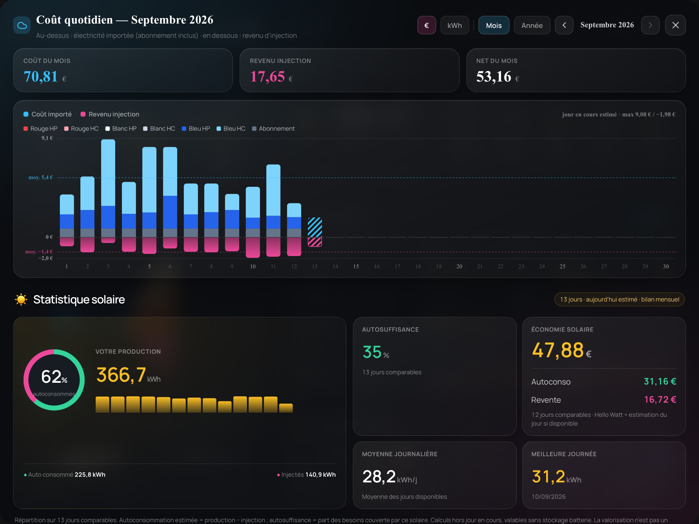

# Hello Watt pour Home Assistant

Récupérez vos données Hello Watt dans Home Assistant : **coût électrique abonnement inclus, revenu d’injection, consommation réseau, injection et production solaire en kWh, valorisation solaire en euros et détail des six tarifs Tempo**, avec le détail par jour, par mois et par année.

Le collecteur se connecte une fois par jour, enregistre les données dans une base locale et publie les capteurs via MQTT. L’historique commence le **1er janvier 2026** et les années précédentes sont conservées.

> Projet personnel non officiel, indépendant de Hello Watt. Il utilise les requêtes du site connecté, qui peuvent évoluer. Version décrite : **0.6.0**.

## Sommaire

- [Fonctionnalités](#fonctionnalités)
- [Prérequis](#prérequis)
- [Installation pas à pas](#installation-pas-à-pas)
- [Configuration](#configuration)
- [Première collecte](#première-collecte)
- [Capteurs et historiques](#capteurs-et-historiques)
- [Afficher un graphique](#afficher-un-graphique)
- [Collecte et conservation](#collecte-et-conservation)
- [Mise à jour et sauvegardes](#mise-à-jour-et-sauvegardes)
- [Dépannage](#dépannage)
- [Fonctionnement technique](#fonctionnement-technique)
- [État des validations](#état-des-validations)
- [Production solaire](#production-solaire--version-040)
- [Horaire quotidien](#horaire--version-041)
- [Détail Tempo et mise à jour 0.5.0](#couleurs-tempo--version-050)

## Fonctionnalités

| Donnée | Unité | Périodes disponibles |
|---|---|---|
| Coût de l’électricité achetée, abonnement inclus | € | Jour, mois, année |
| Part de l’abonnement, déjà comprise dans le coût | € | Attributs journaliers, mensuels et annuels |
| Revenu de l’électricité injectée | € | Jour, mois, année |
| Électricité consommée sur le réseau | kWh | Jour, mois, année |
| Électricité injectée sur le réseau | kWh | Jour, mois, année |
| Production solaire totale | kWh | Jour, mois, année |
| Valorisation de la production solaire fournie par Hello Watt | € | Jour, mois, année |
| Détail Tempo : bleu/blanc/rouge × HP/HC | € et kWh | Attributs journaliers ; agrégeables par mois et année |

- Collecte quotidienne à **8 h, fuseau Europe/Paris**, avec changement d’heure automatique.
- Seuls les jours terminés sont collectés : le jour en cours n’est pas estimé par le script.
- Rattrapage des mois depuis janvier 2026.
- Conservation des années passées : en 2027, l’archive 2026 reste disponible.
- Actualisation des corrections et reprise des mois manquants après un échec.
- Découverte automatique des capteurs par MQTT.
- Graphiques possibles depuis les attributs, sans attendre de constituer un nouvel historique.

La consommation réseau n’inclut pas l’électricité solaire consommée directement dans le logement. L’injection correspond à l’énergie exportée, **pas à toute la production photovoltaïque**.



*Exemple d’affichage avec une carte personnalisée distincte du collecteur.*

## Prérequis

### Home Assistant

- Une installation avec **Supervisor et boutique d’applications/modules complémentaires**, typiquement Home Assistant OS.
- Une architecture **64 bits ARM (`aarch64`) ou x86 (`amd64`)**.
- Un accès administrateur à Home Assistant pour installer et configurer le module.
- Un accès aux fichiers des applications locales, par exemple avec **Samba share**.

Cette procédure n’est pas une installation HACS. Une installation Home Assistant Container seule ne fournit pas la boutique nécessaire ; le lancement autonome du script n’est pas couvert par ce guide.

Les libellés changent selon les versions : « Applications », « Apps », « Modules complémentaires » et « Add-ons » désignent ici la même fonction.

### Compte Hello Watt

- Un compte accessible par **adresse e-mail et mot de passe**.
- Un logement dont les données de consommation sont visibles sur le site.
- Pour l’injection : les données d’injection doivent déjà être présentes sur le compte.
- Aucun numéro de logement à rechercher si le compte contient un seul logement : il est détecté après connexion.

Le collecteur ne peut pas produire des mesures que Hello Watt ne possède pas. La connexion Google/Apple seule, les CAPTCHA et les parcours avec validation interactive ne sont pas implémentés.

### MQTT

- Un broker MQTT démarré, par exemple **Mosquitto broker** dans Home Assistant.
- L’intégration **MQTT** configurée dans Home Assistant, avec découverte des entités.
- Un utilisateur et un mot de passe que le broker accepte.

### Réseau

La machine doit pouvoir résoudre les noms DNS et joindre les services nécessaires :

- Hello Watt en HTTPS pour les collectes ;
- les registres Docker, PyPI et les dépôts Alpine pour construire l’application ;
- le broker MQTT pour publier les capteurs.

Python et les dépendances sont installés **dans l’image du module**. Il n’est pas nécessaire d’installer Python sur Home Assistant ni d’accéder directement à Docker.

## Installation pas à pas

### 1. Préparer Mosquitto

Si nécessaire, installez **Mosquitto broker** depuis la boutique Home Assistant, démarrez-le puis configurez l’intégration MQTT proposée dans **Paramètres → Appareils et services**. Si MQTT fonctionne déjà, conservez sa configuration.

Avec le module officiel Mosquitto, créez un utilisateur dédié dans **Paramètres → Personnes → Utilisateurs**, par exemple `hellowatt_mqtt`, avec un mot de passe et sans droits administrateur. Si l’onglet manque, activez le mode avancé dans votre profil. Ces accès seront utilisés dans la configuration Hello Watt. Les noms `homeassistant` et `addons` sont réservés. [Documentation Mosquitto](https://github.com/home-assistant/addons/blob/master/mosquitto/DOCS.md#how-to-use).

Avec un autre broker, utilisez un compte créé sur ce broker. Un utilisateur Home Assistant n’est pas automatiquement accepté par tous les serveurs MQTT.

### 2. Accéder au dossier des applications locales

Installez et configurez **Samba share**, puis ouvrez ses partages depuis votre ordinateur. Les identifiants Samba servent à accéder aux fichiers ; ils sont distincts des accès Hello Watt et MQTT.

Sur macOS : Finder → **Aller → Se connecter au serveur** (`⌘K`), puis :

```text
smb://ADRESSE_IP_HOME_ASSISTANT
```

Sur Windows, ouvrez dans l’Explorateur :

```text
\\ADRESSE_IP_HOME_ASSISTANT
```

Ouvrez le partage des applications locales. Il s’appelle **`addons`** sur les versions utilisées lors des premiers essais, ou **`local_apps`** dans des versions plus récentes de Samba. Le nom proposé par votre version fait référence. Un dossier vide est normal : il contient vos applications locales, pas les sources de toutes les applications installées. [Installation locale Home Assistant](https://developers.home-assistant.io/docs/apps/tutorial/).

Si seuls `config` et `media` apparaissent, vérifiez `enabled_shares` dans Samba. Sur une version utilisant `addons`, ajoutez cette entrée **à la liste existante** :

```yaml
enabled_shares:
  - config
  - media
  - addons
```

Si votre version propose `local_apps`, activez cette entrée à la place. Conservez vos autres partages et les autres options Samba. Enregistrez, redémarrez **uniquement Samba** si nécessaire, puis reconnectez le partage. [Configuration officielle Samba](https://github.com/home-assistant/addons/blob/master/samba/config.yaml).

Créer un dossier `addons` à l’intérieur du partage `config` ne crée pas une application locale au bon emplacement.

### 3. Copier les fichiers

Téléchargez le projet ou l’archive de distribution. Placez le dossier `hellowatt_daily` dans le partage des applications locales. Structure attendue :

```text
addons/                         # ou partage local_apps
└── hellowatt_daily/
    ├── config.yaml
    ├── Dockerfile
    ├── requirements.txt
    ├── collecteur.py
    ├── run.py
    ├── start.sh
    └── README.md
```

Copiez le dossier contenant directement `config.yaml` et `Dockerfile`, sans ajouter un deuxième niveau `hellowatt_daily/hellowatt_daily`.

Ce projet ne va pas dans `www` ni dans `custom_components`. Le fichier `Dockerfile` ne doit pas devenir `Dockerfile.txt`. Conservez les fins de ligne LF des scripts.

### 4. Installer l’application

Dans la boutique Home Assistant, ouvrez le menu `⋮` puis **Rechercher les mises à jour / Actualiser**. Ouvrez **Hello Watt — collecte quotidienne** dans la section des applications locales et cliquez sur **Installer**. La première installation construit une image et peut prendre plusieurs minutes.

En cas d’échec de construction, consultez les journaux **Supervisor**. Les journaux propres à Hello Watt concernent son exécution après installation.

### 5. Connexion Hello Watt : logement détecté automatiquement

Renseignez votre adresse e-mail et votre mot de passe Hello Watt. Laissez `home_id: ""` : le module récupère la liste des logements après authentification. Aucune ouverture des outils de développement n’est nécessaire.

- Un seul logement : sélection automatique.
- Plusieurs logements et un seul logement déjà présent dans la base locale correspond à cette liste : conservation de ce logement.
- Plusieurs logements sans choix unique : la collecte s’arrête en indiquant leurs numéros dans les journaux. Copiez le numéro souhaité dans `home_id`, puis demandez un nouvel essai manuel.
- Aucun logement ou réponse inattendue : un message explicite est affiché et les données enregistrées restent conservées.

Un `home_id` déjà renseigné reste prioritaire : la mise à jour ne change pas le logement sélectionné. La découverte automatique vérifie la liste accessible au compte à chaque collecte ; elle ne tente pas de deviner des numéros. Une liste paginée non prise en charge est signalée au lieu de sélectionner un résultat incomplet.

## Configuration

Dans **Hello Watt → Configuration**, renseignez les options. Exemple à remplacer par vos propres valeurs :

```yaml
email: "votre-adresse@example.com"
password: "VOTRE_MOT_DE_PASSE_HELLO_WATT"
home_id: ""
mqtt_host: core-mosquitto
mqtt_port: 1883
mqtt_user: hellowatt_mqtt
mqtt_password: "VOTRE_MOT_DE_PASSE_MQTT"
mqtt_tls: false
run_on_start: true
retry_once: ""
```

| Option | Rôle |
|---|---|
| `email` | Adresse de connexion Hello Watt. |
| `password` | Mot de passe Hello Watt, avec ses caractères habituels. |
| `home_id` | Facultatif. Vide = détection automatique ; un numéro explicite permet de choisir un logement et reste prioritaire. |
| `mqtt_host` | `core-mosquitto` pour le module officiel local ; sinon adresse de votre broker. |
| `mqtt_port` | `1883` pour l’exemple MQTT local sans TLS ; adapter au broker. |
| `mqtt_user` | Utilisateur accepté par MQTT. |
| `mqtt_password` | Mot de passe MQTT. |
| `mqtt_tls` | Active TLS pour MQTT ; ne concerne pas la connexion HTTPS Hello Watt. |
| `run_on_start` | Lance un essai au démarrage, dans la limite quotidienne. |
| `retry_once` | Nouvelle valeur non vide = un essai manuel supplémentaire au démarrage. |

Le mode TLS utilise les autorités de certification disponibles dans l’image. Les certificats client et l’ajout d’une autorité privée ne sont pas configurables dans cette version. Si vous activez TLS, adaptez aussi explicitement le port, souvent `8883`.

Entrez les identifiants dans l’interface Home Assistant. Ne remplacez pas les valeurs par défaut du fichier public `config.yaml` par vos secrets avant de publier sur GitHub.

**Un texte encodé n’est pas masqué** : `%40` représente `@`, `%21` représente `!`. Le script effectue lui-même l’encodage nécessaire. Si un vrai mot de passe a été partagé dans un journal, une capture ou une issue, changez-le.

## Première collecte

1. Enregistrez la configuration avec `run_on_start: true`.
2. Cliquez sur **Démarrer**.
3. Ouvrez l’onglet **Journal**.

Le déroulement attendu est :

```text
Étape 1/5 : préparation de la connexion Hello Watt.
Étape 2/5 : authentification Hello Watt.
Étape 3/5 : récupération du mois 2026-09.
... autres mois à récupérer ...
Étape 4/5 : calcul des historiques journaliers, mensuels et annuels.
Étape 5/5 : publication MQTT.
... résumé JSON ...
Collecte terminée.
```

Le premier passage récupère les mois depuis janvier 2026, en commençant par les plus récents. Dans le résumé :

- `mois_recuperes` compte les mois dont la requête a été traitée sans récupération en cours annoncée par Hello Watt ;
- `mois_attendus` compte les mois à consulter depuis janvier 2026 ;
- les compteurs de journées par mesure indiquent la couverture réellement disponible.

Un mois consulté peut avoir des données absentes sur le compte. Un total partiel n’est pas présenté comme une facture complète.

Après réussite, remettez :

```yaml
run_on_start: false
retry_once: ""
```

Enregistrez et laissez le module démarré. Activez également **Démarrer au démarrage** pour qu’il reprenne lors d’un futur démarrage de la machine.

Pour autoriser un nouvel essai le même jour, utilisez par exemple :

```yaml
run_on_start: true
retry_once: "essai-2"
```

Enregistrez puis démarrez ou redémarrez **uniquement Hello Watt**. Le même texte n’autorise pas plusieurs essais consécutifs ; changez-le pour demander un nouvel essai. Remettez ensuite les options normales.

## Capteurs et historiques

Dans **Paramètres → Appareils et services → MQTT**, cherchez l’appareil **Hello Watt**.

### Capteurs de montants et d’énergie

Dix-huit capteurs couvrent six mesures principales sur trois périodes :

| Période | Coût électrique | Revenu injection | Consommation réseau | Injection réseau | Production solaire | Valorisation solaire |
|---|---|---|---|---|---|---|
| Mois courant | EUR | EUR | kWh | kWh | kWh | EUR |
| Veille | EUR | EUR | kWh | kWh | kWh | EUR |
| Année courante | EUR | EUR | kWh | kWh | kWh | EUR |

Les noms des entités sont attribués par Home Assistant ; ils peuvent différer selon votre installation. Copiez l’identifiant exact depuis l’entité. Les quatre capteurs des versions antérieures conservent leurs identifiants uniques.

Les attributs communs comprennent :

| Attribut | Contenu |
|---|---|
| `jours` | Journées du mois courant, du premier du mois jusqu’à hier. |
| `mois_historique` | Totaux mensuels de l’année courante. |
| `annees` | Totaux par année depuis 2026. |
| `date_veille` | Date correspondant aux six mesures de la veille. |
| `mois_recuperes`, `mois_attendus` | Progression du rattrapage. |
| `collecte_reussie_a` | Date de préparation des données publiées lors du passage réussi. |

### Un capteur d’historique par année

**Historique 2026** contient toutes les périodes de 2026. En 2027, **Historique 2027** est ajouté ; Historique 2026 reste publié.

L’état du capteur est le nombre de jours comportant au moins une mesure. Les données financières et énergétiques sont dans ses attributs :

- `jours` : une entrée par date passée de l’année ;
- `mois` : une entrée par mois commencé de l’année ;
- `electricite`, `abonnement`, `injection`, `consommation_kwh`, `injection_kwh`, `production_kwh`, `production_eur` : totaux annuels ;
- suffixes `_jours` et `_derniere_date` : couverture de chaque total ;
- `jours_attendus`, `jours_enregistres`, `mois_recuperes` et `mois_attendus` : progression et disponibilité.

Exemple fictif d’une journée :

```yaml
jours:
  - date: "2026-01-01"
    electricite: 4.35
    abonnement: 0.75
    injection: 0.82
    consommation_kwh: 24.6
    injection_kwh: 6.5
    production_kwh: 12.0
    production_eur: 1.70
    tempo_eur:
      Tempo-blue-HP: 2.40
      Tempo-blue-HC: 1.20
    tempo_kwh:
      Tempo-blue-HP: 14.6
      Tempo-blue-HC: 10.0
```

Ici, l’abonnement de 0,75 € est **déjà inclus** dans les 4,35 €. Ne l’ajoutez pas une deuxième fois.

Le détail Tempo est présent dans `jours` du mois courant et dans `jours` des archives annuelles. Les clés tarifaires absentes ne sont pas ajoutées artificiellement. Les objets mensuels et annuels ne contiennent pas de ventilation Tempo préagrégée : additionnez les journées de la période pour obtenir cette ventilation.

Une mesure absente vaut `null`. Un zéro réel reste `0`. Les valeurs quotidiennes conservent leur précision source ; les totaux sont arrondis après addition, à deux décimales pour les euros et trois pour les kWh.

### Pourquoi la courbe d’historique native ne montre-t-elle pas janvier ?

Les anciennes journées sont publiées dans des attributs datés. MQTT ne les insère pas rétroactivement dans l’historique natif du capteur. La version actuelle ne fournit pas non plus d’import de statistiques dans le tableau Énergie.

Pour afficher les dates passées, utilisez une carte qui lit ces attributs, comme dans l’exemple suivant. Les capteurs de la veille sont enregistrés par Home Assistant à leur réception, pas à la date de consommation.

## Afficher un graphique

**ApexCharts Card**, facultative et disponible via HACS, peut tracer les attributs avec `data_generator`. [Documentation de la carte](https://github.com/RomRider/apexcharts-card#data_generator-option).

Après installation de cette carte, ajoutez une carte **Manuelle** au dashboard. Remplacez les deux occurrences de `sensor.votre_capteur_hellowatt` ci-dessous par l’identifiant d’un capteur usuel du module contenant `jours`.

```yaml
type: custom:apexcharts-card
header:
  show: true
  title: Électricité · kWh par jour
  show_states: false
graph_span: 31d
span:
  start: month
yaxis:
  - min: 0
    decimals: 2
apex_config:
  chart:
    height: 320
    stacked: false
  plotOptions:
    bar:
      columnWidth: "65%"
  dataLabels:
    enabled: false
  xaxis:
    labels:
      datetimeUTC: false
      format: dd/MM
  tooltip:
    shared: true
    intersect: false
    x:
      format: dd/MM/yyyy
series:
  - entity: sensor.votre_capteur_hellowatt
    name: Consommation réseau
    type: column
    unit: kWh
    color: "#60A5FA"
    float_precision: 3
    data_generator: |
      return (entity.attributes.jours || []).map(j => [
        new Date(j.date + "T12:00:00").getTime(),
        j.consommation_kwh == null ? null : Number(j.consommation_kwh)
      ]);
  - entity: sensor.votre_capteur_hellowatt
    name: Injection réseau
    type: column
    unit: kWh
    color: "#34D399"
    float_precision: 3
    data_generator: |
      return (entity.attributes.jours || []).map(j => [
        new Date(j.date + "T12:00:00").getTime(),
        j.injection_kwh == null ? null : Number(j.injection_kwh)
      ]);
```

Cette fenêtre commence au premier du mois et couvre 31 jours : les dates futures restent vides. Les dates sont interprétées dans le fuseau du navigateur ; utilisez Europe/Paris pour un affichage cohérent avec la collecte.

Pour les euros, utilisez `j.electricite` et `j.injection`, l’unité `€`, une précision de `2` et les libellés correspondants.

Pour un ancien mois, choisissez le capteur **Historique de l’année concernée**, filtrez `jours` avec par exemple `j.date.startsWith("2026-04-")` et adaptez la plage temporelle de la carte. Pour les totaux mensuels, lisez `mois` sur ce capteur annuel ; chaque ligne possède une clé `date` correspondant au premier jour du mois. Les totaux annuels se trouvent dans `annees` sur les capteurs usuels.

## Collecte et conservation

### Fréquence

- Une tentative quotidienne à 8 h, heure de Paris, été comme hiver.
- Une seule connexion au compte par passage, puis plusieurs requêtes de données dans cette session.
- Au plus douze mois traités par passage pendant le rattrapage.
- Une fois le rattrapage terminé : actualisation du mois courant, du précédent et d’un ancien mois à tour de rôle.
- Durée totale maximale de **600 secondes**, publication MQTT comprise.
- Aucune nouvelle tentative automatique immédiate après une erreur.

Le script s’arrête après son travail. Le planificateur reste actif pour le lendemain, y compris après un essai au démarrage en échec. Si le module est arrêté à 8 h, il n’existe pas de rattrapage horaire automatique ; un essai manuel reste possible.

### Reprise et données manquantes

Chaque mois terminé est enregistré immédiatement. Si le mois suivant échoue, les données déjà enregistrées restent conservées et les mois manquants seront repris lors des passages suivants. Les messages MQTT sont publiés après la fin de la collecte : ils peuvent donc rester sur leurs anciennes valeurs si le passage échoue en cours de rattrapage.

Si Hello Watt annonce une récupération encore en cours, le mois n’est pas marqué terminé. Les corrections remplies remplacent les anciennes valeurs ; un champ absent ne détruit pas une valeur connue.

Les compteurs de couverture distinguent les jours attendus et les jours mesurés. Les totaux additionnent seulement les valeurs connues. Les capteurs peuvent rester sur une ancienne publication lors d’une panne : consultez la date de collecte et le journal.

### Passage à une nouvelle année

La base ne supprime pas les données de l’année précédente. Au début de 2027 :

- les capteurs du mois et de l’année courante passent à 2027 ;
- l’archive 2026 reste disponible avec ses jours et ses mois ;
- l’archive 2027 est créée ;
- le 1er janvier, les capteurs de la veille concernent encore le 31 décembre 2026.

Le même fonctionnement s’applique aux années suivantes. Les anciennes périodes peuvent encore être corrigées par les actualisations tournantes.

## Mise à jour et sauvegardes

Pour mettre à jour, remplacez les fichiers sources dans le dossier local existant, actualisez la boutique puis utilisez **Mettre à jour**. Ne désinstallez pas le module pour une mise à jour courante : sa base est dans son stockage persistant.

| Fichier interne | Rôle |
|---|---|
| `/data/options.json` | Configuration et identifiants, gérés par Home Assistant. |
| `/data/hellowatt.sqlite` | Historique des jours et suivi des mois récupérés. |
| `/data/hellowatt.sqlite.avant-0.5.0.bak` | Copie unique de la base existante avant la migration 0.5.0. |
| `/data/last_attempt.txt` | Date de la dernière tentative. |
| `/data/last_retry.txt` | Dernier identifiant d’essai manuel consommé. |
| `/data/last_run.json` | Date et résultat du dernier passage. |

Ces chemins sont **internes au module**, pas des fichiers à créer dans le partage `config`. Incluez Hello Watt dans vos sauvegardes Home Assistant. Conserver plusieurs années dans SQLite ne protège pas contre la perte du disque ou la désinstallation.

Pour publier le projet sur GitHub, publiez les sources et la documentation. Excluez les bases SQLite, sauvegardes, fichiers `.env`, `options.json`, exports de compte, captures d’authentification et journaux personnels. La base contient des habitudes de consommation ; les sauvegardes peuvent contenir les identifiants.

## Dépannage

### Le module n’apparaît pas dans la boutique

Vérifiez l’emplacement dans le partage des applications locales, le niveau du dossier et la présence de `config.yaml`. Actualisez la boutique puis consultez le journal Supervisor pour une erreur de manifeste ou une architecture incompatible.

### L’installation échoue sur `files.pythonhosted.org`

L’erreur rencontrée pendant le développement était :

```text
Failed to establish a new connection: [Errno -5] Name has no usable address
```

Dans ce cas, l’échec concernait le téléchargement des dépendances avant toute connexion Hello Watt.

Depuis un terminal Home Assistant disposant de `nslookup`, comparez :

```sh
nslookup files.pythonhosted.org
nslookup files.pythonhosted.org 1.1.1.1
```

Si la première réponse ne contient qu’un alias `dualstack.python.map.fastly.net` sans adresse IP et que la seconde donne des adresses, le DNS habituel est une piste. Ce test dans le terminal ne prouve pas à lui seul que le réseau de construction Docker fonctionne.

Dans l’installation de développement, le DNS de la box renvoyait des réponses inutilisables pour certains domaines. Le réglage du DNS interne a été effectué avec :

```sh
ha dns options --servers dns://1.1.1.1
ha dns restart
```

`ha dns restart` redémarre le service DNS, pas toute la machine. Ces réglages sont un dépannage réseau à utiliser après diagnostic, pas un prérequis systématique de l’application. Notez la configuration précédente avant de la modifier et tenez compte d’éventuels noms DNS privés.

Le DNS de l’interface hôte se vérifie séparément avec :

```sh
ha network info
```

Sur une interface **déjà en DHCP**, la commande utilisée a été :

```sh
ha network update NOM_INTERFACE --ipv4-method auto --ipv4-nameserver 1.1.1.1
```

Remplacez `NOM_INTERFACE` par l’interface active réellement indiquée par `ha network info`. Cette commande peut provoquer une brève reconnexion. **Ne l’appliquez pas à une configuration IP statique sans adapter le réglage.** L’option `--ipv4-method auto` était nécessaire : sans elle, la tentative avait échoué avec `method 'manual' requires at least an address or a route`. [Commande réseau officielle](https://github.com/home-assistant/cli/blob/master/cmd/network_update.go).

La box pouvait rester présente comme DNS fourni par DHCP. Avec Alpine/musl, plusieurs serveurs peuvent être interrogés en parallèle : une réponse incorrecte de la box peut arriver avant la bonne. C’était une explication plausible à un `nslookup` réussi alors que Python échouait encore. [Comportement DNS de musl](https://wiki.musl-libc.org/functional-differences-from-glibc.html#Name-Resolver/DNS).

**Le Dockerfile distribué contient la solution de construction validée** : téléchargement des paquets Python portables dans une étape Debian, puis installation depuis ces fichiers dans l’image Alpine avec `--no-index`. Il n’écrit pas dans `/etc/resolv.conf`, qui s’était révélé en lecture seule pendant la construction. Cette solution ne répare pas une panne DNS générale, mais a permis de terminer la construction dans l’environnement rencontré. [Téléchargement puis installation locale avec pip](https://pip.pypa.io/en/stable/cli/pip_download/).

Aucun redémarrage complet de Home Assistant et aucune désactivation du mode de protection SSH ne sont nécessaires à la procédure d’installation décrite ici.

### Le terminal affiche `PROTECTION MODE ENABLED!`

Ce message concerne l’accès direct à Docker depuis le terminal. Le projet n’exige pas cet accès : installez et mettez à jour depuis la boutique. Il n’est pas nécessaire de désactiver la protection pour utiliser Hello Watt.

### La connexion échoue avec HTTP 400 à l’étape 2

Dans les premières versions, le script envoyait les identifiants en JSON. La requête réussie du navigateur utilisait un formulaire `application/x-www-form-urlencoded`. Le code actuel utilise `data={...}` avec Requests, et conserve les en-têtes CSRF et `X-Requested-With: XMLHttpRequest`.

Vérifiez que vous utilisez la version actuelle, les bons identifiants et le mot de passe non encodé. Un code 400 ne prouve pas à lui seul que le mot de passe est incorrect ; le site peut aussi avoir changé.

Ne publiez pas la réponse complète de connexion : le formulaire JSON retourné par le site peut contenir le mot de passe saisi.

### Cookie CSRF absent, HTTP 403 ou connexion non confirmée

Vérifiez que la connexion normale sur le site fonctionne. Un changement du formulaire, une protection du site ou une redirection différente peut nécessiter une adaptation du collecteur. Évitez les essais répétés ; joignez à une issue la version du module, l’étape et le code HTTP, sans cookies ni identifiants.

### Échec à l’étape 5 : publication MQTT

Vérifiez que le broker est démarré, que l’hôte, le port, l’utilisateur et le mot de passe sont corrects et que TLS correspond à sa configuration. Consultez le journal Mosquitto pour un refus d’authentification ou de publication. Si vous avez configuré des ACL, autorisez les topics de découverte et de données du collecteur.

Les données déjà enregistrées restent dans SQLite. Après correction, un essai manuel peut republier les données.

### `Une tentative a déjà eu lieu aujourd’hui`

Le passage quotidien a déjà été consommé, même s’il a échoué. Pour un essai supplémentaire, activez `run_on_start` et changez `retry_once`, puis redémarrez seulement le module. Aucun besoin de supprimer la base ou les marqueurs manuellement.

### Les capteurs sont absents malgré `Collecte terminée`

Vérifiez l’intégration MQTT de Home Assistant, sa connexion au même broker et la découverte des entités. Cherchez l’appareil Hello Watt, y compris les entités désactivées ou renommées.

### Je ne vois que la veille ou un total mensuel

Le détail des anciennes dates se trouve dans les **attributs**. Dans **Outils de développement → États**, choisissez le capteur et cherchez `jours`, ou ouvrez Historique de l’année pour trouver aussi `mois`.

### Certains montants sont absents ou anciens

Vérifiez la date de collecte, les compteurs `_jours`, les dernières dates et les journaux. Le site peut fournir la consommation et l’injection avec des délais différents. Le jour en cours est volontairement exclu. Au premier du mois, un total sans journée disponible reste indisponible plutôt que zéro.

## Fonctionnement technique

| Fichier | Fonction |
|---|---|
| `config.yaml` | Manifeste du module et schéma des options. |
| `Dockerfile` | Construction en deux étapes et installation des dépendances. |
| `requirements.txt` | Requests et Paho MQTT. |
| `collecteur.py` | Connexion, requêtes, normalisation, SQLite, agrégations et MQTT. |
| `run.py` | Lecture des options, verrou, fréquence, essai manuel et délai maximal. |
| `start.sh` | Planification à 8 h et démarrage de cron. |

Le collecteur ouvre une session HTTP, obtient le cookie CSRF, poste le formulaire de connexion, puis consulte les données journalières par plages mensuelles. Les cookies restent en mémoire et sont effacés localement en fin de passage ; cela ne garantit pas la révocation de la session côté serveur.

Aucune dépendance à un cookie copié manuellement ni à une session de navigateur laissée ouverte. Le stockage conserve les dates et les valeurs utiles ; les réponses brutes, identifiants de compteur et détails du compte ne sont pas archivés dans SQLite.

Les publications MQTT utilisent QoS 1 et des messages retenus :

```text
hellowatt/<home_id>/state
hellowatt/<home_id>/archives/<annee>
homeassistant/sensor/hellowatt_<home_id>/<cle>/config
```

Le module ne commande aucun équipement et ne modifie ni les intégrations Tesla/météo ni le dashboard. Les changements DNS décrits dans le dépannage sont des actions de l’administrateur, pas des opérations exécutées par le collecteur.

## État des validations

- Connexion réelle par formulaire et publication MQTT validées pendant le développement.
- Construction ARM64 validée avec le Dockerfile Debian/Alpine ; l’architecture amd64 est déclarée mais n’a pas fait l’objet du même essai matériel.
- Version 0.3.0 : calculs testés hors ligne sur un export de janvier à septembre 2026.
- Tests couvrant la migration SQLite, les valeurs manquantes, les zéros, les corrections, la reprise mensuelle, les unités MQTT, les années bissextiles et le passage 2026 → 2027.
- Version 0.5.0 : tests hors ligne du détail Tempo, de sa conservation et de la cohérence des sommes avec les montants source. La disponibilité des données historiques, de production et de tarification dépend du compte Hello Watt ; les tests ne garantissent pas la présence de chaque mesure sur chaque compte.

Pour signaler un problème, indiquez la version du module, l’architecture, l’étape en échec et un extrait de journal anonymisé. Ne joignez jamais de mot de passe, cookie, fichier options.json ou export HAR non nettoyé.

## Production solaire — version 0.4.0

La production solaire est récupérée depuis le 1er janvier 2026, en plus des mesures existantes :

| Clé dans les attributs | Champ Hello Watt | Unité |
|---|---|---|
| `production_kwh` | `solarProductionValueKwh` | kWh |
| `production_eur` | `solarProductionValueEur` | EUR |

`production_eur` est la valorisation affichée par Hello Watt, reprise telle quelle. Ce n’est pas un revenu d’injection supplémentaire à additionner à `injection`. Le collecteur ne recalcule pas cette valorisation à partir d’un tarif supposé.

Six capteurs sont ajoutés : **Production solaire** et **Valorisation solaire**, pour la veille, le mois courant et l’année courante. Les valeurs datées sont aussi présentes dans `jours`, `mois_historique`, `annees` et dans les attributs `jours` et `mois` des archives annuelles. Les anciennes années restent conservées.

Après mise à jour, le suivi des mois de cette nouvelle version déclenche une relecture depuis janvier 2026, même si la version 0.3.0 avait déjà terminé son rattrapage. Les données existantes ne sont pas effacées. Au maximum douze mois par passage, puis reprise aux passages suivants si nécessaire. Les anciennes tables de suivi restent conservées. La routine quotidienne demeure inchangée.

Pour lancer ce rattrapage immédiatement : mettre à jour sans désinstaller, renseigner `run_on_start: true` et `retry_once: solaire2026`, enregistrer puis démarrer Hello Watt. Après réussite, remettre `run_on_start: false` et `retry_once: ""`.

Validation 0.4.0 : tests hors ligne des champs de production sur l’export réel, migration, rattrapage, conservation des années, zéros et données absentes. Le premier passage réel de cette version reste à vérifier dans les journaux. Le jour en cours reste exclu même si sa production partielle est déjà connue.

Dans une carte utilisant les attributs, les nouvelles valeurs se lisent avec `j.production_kwh` ou `j.production_eur`. L’apparition des capteurs n’ajoute pas automatiquement une courbe de production dans un dashboard personnalisé.

## Horaire — version 0.4.1

La collecte quotidienne démarre désormais à **08:00, Europe/Paris**, avec adaptation automatique à l’heure d’été/hiver. Le déclenchement de midi est remplacé. Après remplacement des sources, mettre à jour le module pour reconstruire son image et vérifier qu’il est démarré. Conserver `run_on_start: false` et `retry_once: ""` pour attendre le prochain passage à 8 h. Si une tentative a déjà eu lieu dans la journée, elle reste comptabilisée. Les identifiants, les données et les règles de rattrapage sont conservés.


## Couleurs Tempo — version 0.5.0

Le collecteur conserve désormais le détail quotidien des six tarifs Tempo transmis par Hello Watt : bleu, blanc et rouge, chacun en heures creuses (HC) et heures pleines (HP). Ce détail est enregistré en euros et en kWh dans la base locale, puis publié dans les attributs `jours` des capteurs : `tempo_eur` et `tempo_kwh`, avec les clés `Tempo-blue-HC`, `Tempo-blue-HP`, `Tempo-white-HC`, `Tempo-white-HP`, `Tempo-red-HC` et `Tempo-red-HP`. Les valeurs manquantes ne sont pas remplacées par zéro.

Le script fournit les données ; les couleurs et les graphiques dépendent de la carte de dashboard utilisée. Aucune carte personnalisée n’est installée par ce module.

La carte Maison adaptative développée séparément peut afficher six segments en vue mensuelle et regrouper HP/HC en trois couleurs en vue annuelle. L’ordre, depuis la base, est abonnement gris (euros uniquement), rouge HP puis HC, blanc HP puis HC, bleu HP puis HC. Les montants HC restent inclus lorsqu’ils sont regroupés avec les HP. L’abonnement est déjà inclus dans le coût importé. Une ventilation absente ou incomplète ne doit pas être remplacée par des couleurs supposées.

Les éventuelles estimations du jour affichées dans cette carte proviennent des capteurs locaux Home Assistant. Elles ne sont ni calculées, ni archivées, ni publiées par ce collecteur. Les réglages des véhicules, PAC, eau chaude et thèmes du dashboard sont indépendants du script.

Mettre à jour le module sans le désinstaller : remplacer les fichiers locaux par ceux de cette version et lancer sa mise à jour pour reconstruire l’image. Le nouveau suivi de rattrapage relit les anciens mois depuis janvier 2026 pour compléter les tarifs, sans supprimer les montants existants ni les années précédentes. Une sauvegarde de migration est créée avant modification de la base existante.

Pour lancer ce rattrapage immédiatement, utiliser `run_on_start: true` et une nouvelle valeur `retry_once: tempo2026`, puis démarrer le module. Après réussite, remettre `run_on_start: false` et `retry_once: ""`. Les couleurs apparaissent après cette collecte et le chargement de la nouvelle carte. La collecte quotidienne reste fixée à **08:00, Europe/Paris**. Aucun redémarrage complet de Home Assistant n’est nécessaire.

Validation hors ligne : migration et conservation des archives, sommes des six tarifs et de l’abonnement sur les données exportées, valeurs nulles et corrections, rendu des trois formats de carte en euros/kWh et mois/année. La collecte connectée de cette version reste à vérifier après installation.


## Détection du logement — version 0.6.0

Cette version supprime la recherche manuelle du numéro de logement pour les comptes à logement unique. La connexion reste réalisée une fois par passage ; la liste des logements est lue avec cette même session authentifiée. Les topics MQTT restent fondés sur le numéro réel du logement, ce qui conserve les identifiants des capteurs et l’historique quand le logement reste le même.

Mettre à jour le module sans le désinstaller, conserver les identifiants Hello Watt et MQTT, puis laisser le numéro existant ou vider `home_id` pour activer la découverte. Pour vérifier immédiatement : `run_on_start: true`, `retry_once: detection-logement-1`, puis redémarrer uniquement le module. Après réussite : `run_on_start: false` et `retry_once: ""`. La collecte quotidienne reste à 8 h, Europe/Paris.

Le mode d’import hors ligne (`--import`) exige toujours `HELLOWATT_HOME_ID`, car il ne se connecte pas au compte. Cette version ne change pas le schéma de données ni le suivi de rattrapage Tempo de la version 0.5.0.

Validation : route de liste `/api/homes` identifiée dans le code public de l’application Hello Watt ; tests hors ligne de sélection, ambiguïtés, réponses invalides et redirections, plus les huit tests d’historique existants. Le premier essai de découverte avec une session authentifiée reste à vérifier après installation. Le module MQTT et ses identifiants demeurent nécessaires : cette automatisation concerne la sélection du logement Hello Watt.
